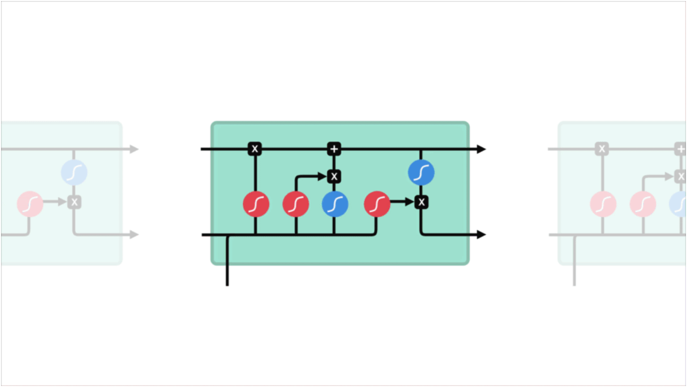
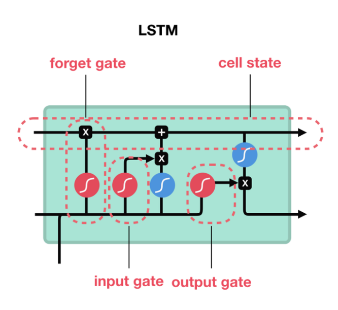
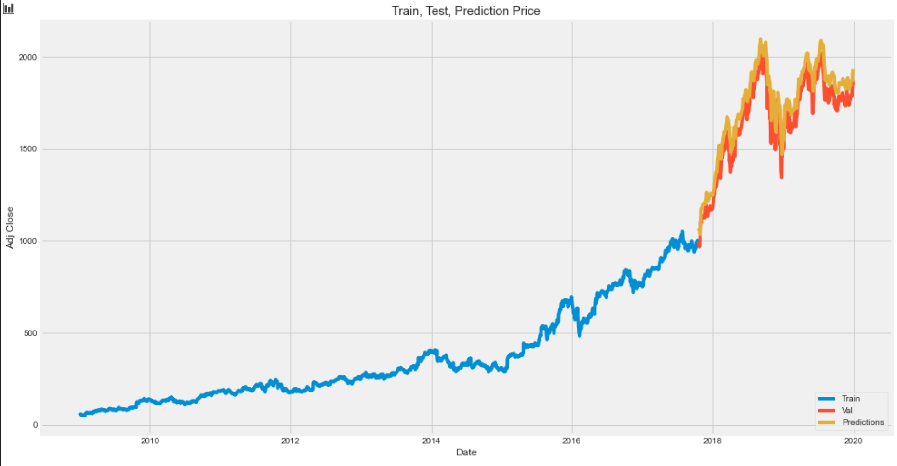
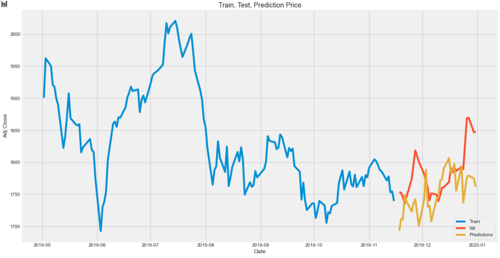

# DataScienceProject
Đồ án cuối kỳ môn Nhập môn Khoa học dữ liệu

## Thông tin nhóm
- STT: Nhóm 3
- Thông tin thành viên
  - Nguyễn Bảo Long - 18120201 - baolongnguyen.mac@gmail.com
  - Mai Ngọc Tú - 18120253 - maingoctu0906@gmail.com

## Đặt vấn đề

- Thị trường chứng khoán biến động thường xuyên và phụ thuộc vào rất nhiều yếu tố ngoại cảnh
- Ngoài các yếu tố ngoại cảnh, sự ảnh hưởng của giá chứng khoán trong quá khứ cũng tác động rất nhiều đến tương lai
- Tìm ra sự tác động này giúp một phần trong việc dự đoán giá chứng khoán

## Giải quyết

### Ý tưởng

- Tìm hiểu LSTM tại [đây](https://dominhhai.github.io/vi/2017/10/what-is-lstm/) và [đây](https://towardsdatascience.com/illustrated-guide-to-lstms-and-gru-s-a-step-by-step-explanation-44e9eb85bf21)
- Sử dụng mạng Long short-term memory để phân tích sự liên hệ giữa quá khứ và tương lai
- Lý do sử dụng LSTM
  - Mạng LSTM hay RNN nói chung được thiết kế ra để xử lý dữ liệu tuần tự: Dữ liệu mà mỗi mẫu trong đó xuất hiện theo thứ tự (ví dụ như thứ tự giá chứng khoán xuất hiện theo thời gian, thứ tự các từ trong câu, thứ tự các nốt nhạc trong 1 bản nhạc)
  - Mỗi nơ-ron của mạng LSTM được thiết kế gồm 3 cổng và 1 thông tin gọi là `cell state`
  
    - `cell state`: Đây là nơi mà một cell dùng để ghi nhớ thông tin (các thông tin này một phần nào đó liên quan đến các thông tin đã xử lý trước đó, phần khác liên quan đến dữ liệu input tại mỗi cell)
    - `forget gate`: Cổng này quyết định việc một thông tin nên được dữ lại hay bị quên đi (đầu vào của cổng này bao gồm dữ liệu input và thông tin từ cell trước đó của mạng)
    - `input gate`: Tại đây chắt lọc các thông tin quan trọng của dữ liệu đầu vào và thông tin từ cell trước đó. Kế đến, nó cập nhật các thông tin này vào `cell state`
    - `output gate`: Cổng này quyết định đầu vào của cell tiếp theo bằng cách tiếp tục chắt lọc thông tin lấy từ `input, cell state và thông tin nhận được từ cell trước đó`

### Thực thi

- Thu thập dữ liệu
  - Sử dụng thư viện `DataReader` của `Pandas`
  - Cài đặt: `pip install pandas-datareader`

- Tiền xử lý
  - Chỉ để lại cột `Adj Close Price` để phục vụ cho việc dự đoán
  - Scale dữ liệu của cột này bằng `sklearn.preprocessing.MinMaxScaler`
  - Chuyển thành dữ liệu mà LSTM có thể đọc được (dữ liệu ở dạng 3D)
    - `sequence`: tổng số dữ liệu đầu vào
    - `time_step`: số dữ liệu input cần cho 1 lần dữ đoán
    - `feature`: số mẫu dữ liệu của 1 output (được tính từ `time_step` dữ liệu input bên trên)

- Build model
  - Sử dụng `LSTM` của thư viện `keras` (cài đặt: `pip install Keras`)
  - Model gồm 1 lớp LSTM
    - Đối với việc dự đoán 1 ngày
      - `time_step = 60`: dùng 60 ngày trước đó cho dữ liệu đầu vào của 1 dữ đoán
      - `feature = 1`: dữ liệu đầu ra là giá của 1 ngày tiếp theo
    - Đối với việc dự đoán 30 ngày
      - `time_step = 1500`: dùng 1500 ngày trước đó cho dữ liệu đầu vào của 1 dự đoán
      - `feature = 30`: dữ liệu đầu ra là giá chứng khoán của 30 ngày tiếp theo

- Tiến hành dự đoán
  - Với việc dự đoán 1 ngày: tập test có 554 giá trị
  - Với việc dự đoán 30 ngày: tập test có 30 giá trị (nếu nhiều hơn thì sẽ phải xử lý việc các dữ liệu output "gối đầu lên nhau")

## Demo
  - Dự đoán giá chứng khoán 1 ngày tiếp theo (tập dữ đoán bao gồm 554 giá trị): `mse = 37.56402968128282`
  
  - Dự đoán giá chứng khoán 30 ngày tiếp theo (tập dự đoán bao gồm 30 giá trị): `mse = 48.23404532574144`
  
